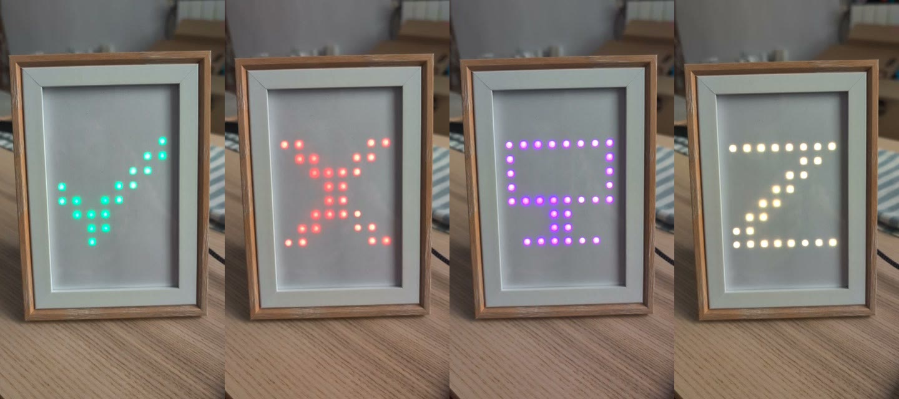
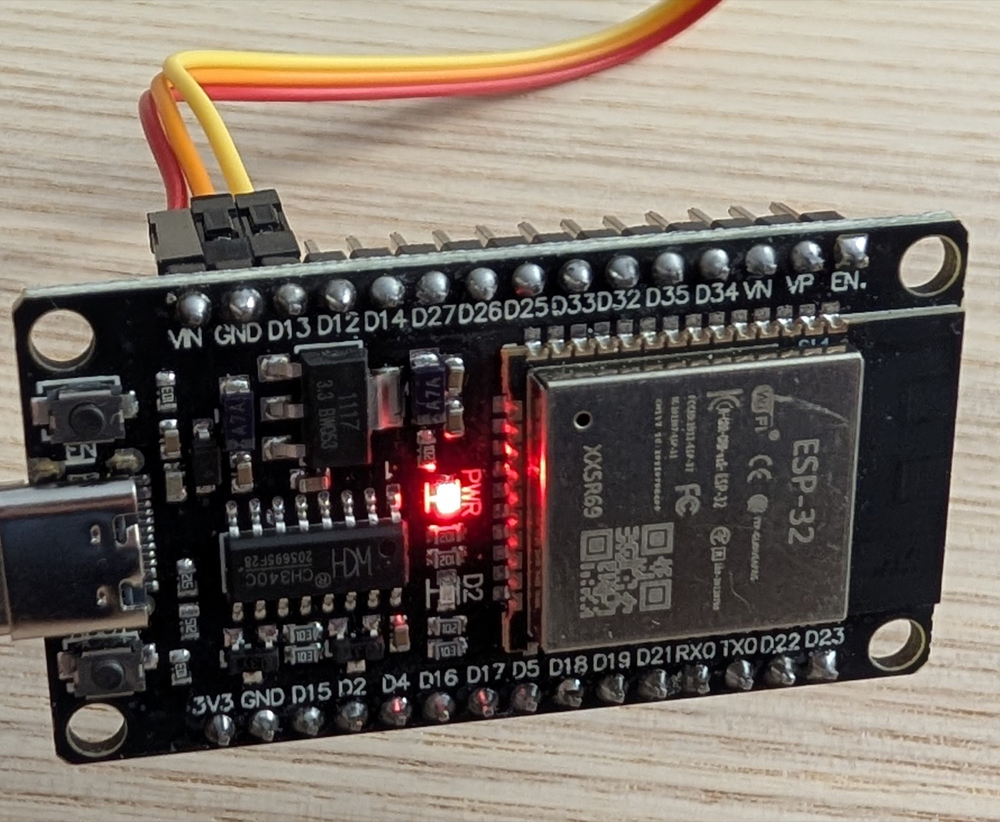
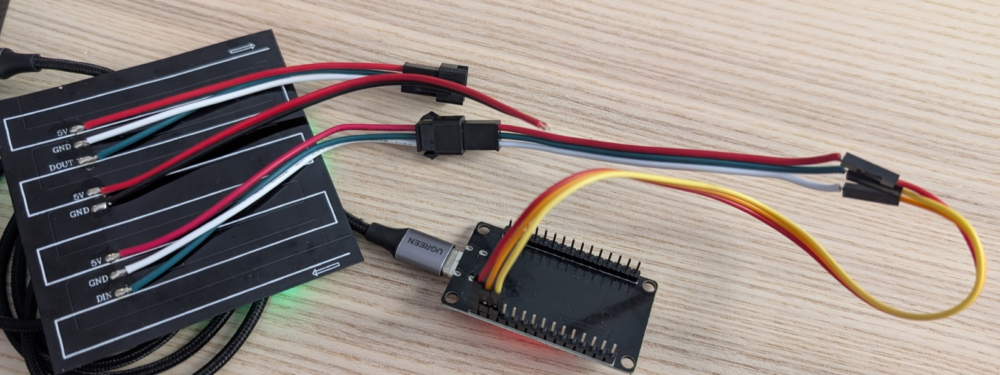
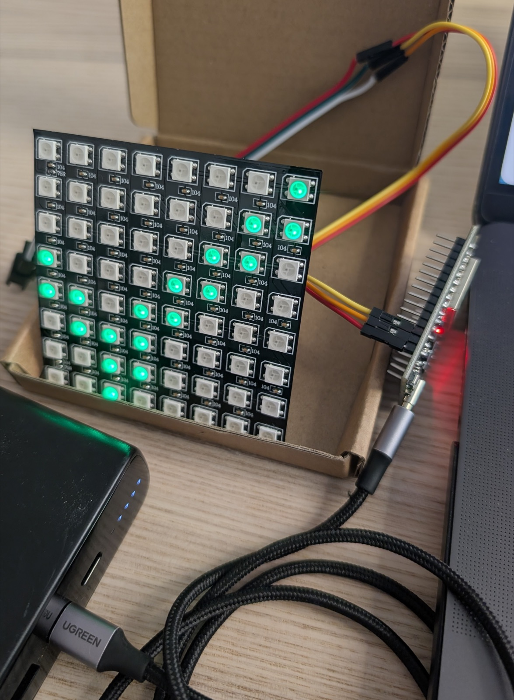
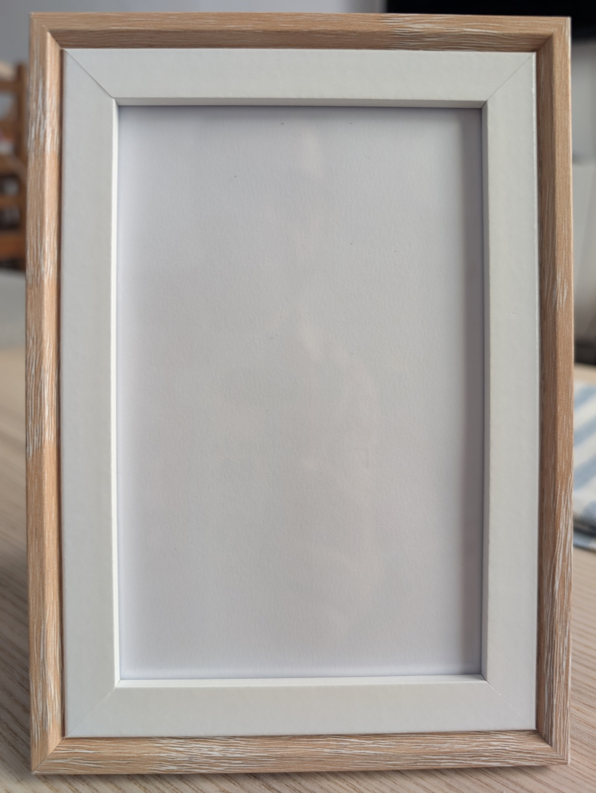
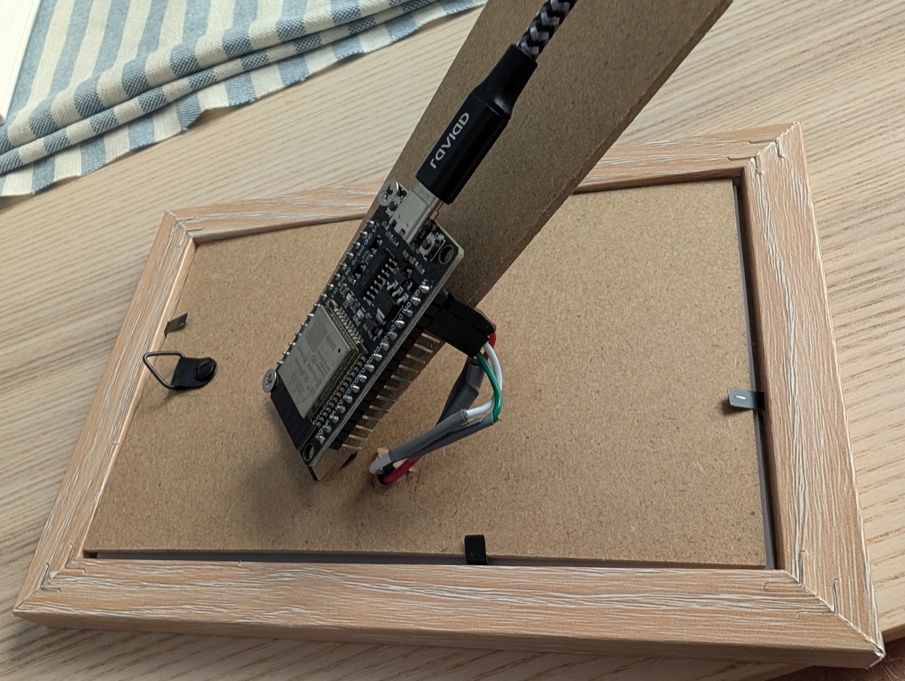
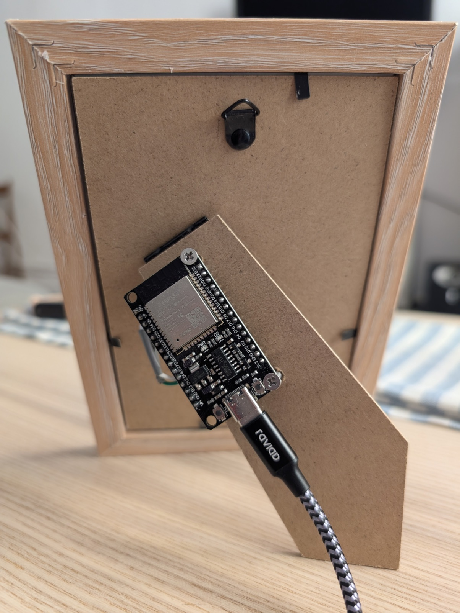

# glowgrid

An 8×8 LED panel that sits on your desk and shows whether you can be
interrupted. It follows your Mac automatically — camera on means you are in a
meeting, microphone on means you are busy — and you can override it from the
menu bar at any time.

[](docs/media/frame-demo.mp4)

Available, busy, in a meeting, away — behind the glass of a €6 photo frame.
▶ **[10-second clip of it cycling through the states](docs/media/frame-demo.mp4)**

About **€27 of parts** and an evening. No Xcode, no 3D printer, no breadboard,
and soldering is optional.

## What it shows

| Status | Icon | Colour |
|---|---|---|
| Available | tick | green |
| Busy | cross | red |
| In a meeting | monitor | purple |
| Away | Z | orange |
| Off | nothing | — |

Icons animate in from the centre, then breathe gently so the panel looks alive
rather than merely switched on. It can also scroll a short message.

## What you need

These are the exact parts this build used, at what they actually cost in Spain.
Nothing here is exotic or hard to substitute.

**Hardware**

- **ESP32 dev board** — [Diymore ESP32 NodeMCU, USB-C, CH340](https://www.amazon.es/dp/B0D9BTQRYT)
  — **€16 for a two-pack**, so about €8 for the one you need. Any ESP32 with
  Bluetooth works; there is nothing special about this one beyond being cheap
  and having USB-C. The pack of two is worth having anyway — a known-good spare
  is how you tell a wiring fault from a dead board.
- **WS2812B 8×8 LED matrix** — [BTF-LIGHTING WS2812B ECO, 64 pixels](https://www.amazon.es/dp/B088W62171)
  — **€13**. 80 × 80 mm, flexible, adhesive backed. Also sold as NeoPixel.
- **3 female-to-female dupont jumper leads** — a euro or two, and often already
  in the drawer.
- **A USB-C data cable.** Charge-only cables do not work and give no useful
  error whatsoever: the serial port simply never appears.
- **A photo frame**, if you want it to look finished — **under €6** from any
  cheap homeware shop. Not every frame will do; see
  [step 6](#6-put-it-in-a-photo-frame) for what to check before buying.

**Optional**

- **A USB power bank**, to run it away from the Mac —
  [Kuulaa 4500 mAh USB-C](https://www.amazon.es/dp/B0G1Y7CJ13) — **€17 for two**,
  about €8.50 each. Read
  [Powering it from a USB battery](#powering-it-from-a-usb-battery) before buying
  any bank, because capacity is not the specification that matters here.

**Software** — a Mac running macOS 13 or later, and Xcode Command Line Tools
(`xcode-select --install`) for the Swift compiler.

**About €27 for one working unit**, or €36 with a battery. No resistors, no
level shifter, no breadboard, no 3D printer.

## Read this before wiring

`VIN` on the ESP32 is passed straight through from the USB 5 V rail, and USB
gives you about 500 mA. A single WS2812 LED can draw 60 mA at full white, so a
64-pixel panel at full white wants **around 3.8 A** — roughly eight times what
USB can supply.

That is fine here, because this project **never runs the panel bright**. The
firmware defaults to brightness 6 out of 255, caps it at 60, and tells FastLED
to keep total draw under 300 mA. At those levels a handful of lit pixels draws
tens of milliamps and USB power is comfortable.

Two rules follow:

- **Do not raise the brightness cap** unless you power the panel from a
  separate 5 V supply.
- If you do use an external supply, connect only `GND` and the data line to the
  ESP32, and make sure the grounds are common. **Never feed `VIN` from an
  external supply while USB is also plugged in.**

Low brightness is not just a power workaround, incidentally. These panels bloom
badly at desk distance and the icons read *better* dim than bright.

## Build it

### 1. Install the toolchain

```sh
brew install arduino-cli

arduino-cli config init
arduino-cli config add board_manager.additional_urls \
  https://espressif.github.io/arduino-esp32/package_esp32_index.json
arduino-cli core update-index
arduino-cli core install esp32:esp32
arduino-cli lib install FastLED
```

Note the board index URL. Many guides still list
`dl.espressif.com/dl/package_esp32_index.json`, which is the old one.

If you prefer the Arduino IDE, it shares `~/Library/Arduino15` with
`arduino-cli`, so configuring either configures both.

### 2. Prove the board works, before wiring anything

```sh
./flash.sh blink_test -m
```

`flash.sh` finds the serial port and pins the upload speed for you. The onboard
LED should blink once per second and the monitor should print `on` / `off`.

Do this first. If something is wrong with the board, the cable or the driver,
you want to find out now rather than while also suspecting your wiring.

**No port found?** Almost always the cable — try a known data cable before
anything else. Failing that, install the CH340 driver:

```sh
brew install --cask wch-ch34x-usb-serial-driver
```

then **restart your Mac** — not the ESP32 — and allow the kernel extension in
System Settings › Privacy & Security. This is a driver install, so it is the
Mac that needs the reboot.

**Upload hangs at `Connecting........`?** The board has two small buttons. Hold
**BOOT** as the upload starts, and release it once the dots give way to writing.
Some clones will not put themselves into the bootloader on their own.

If holding BOOT alone is not enough, do it by hand: **hold BOOT, tap EN, release
BOOT**, then start the upload. The board is now parked in the bootloader waiting
for it.

Which button is which, on the board pictured in step 3: **EN** is at the top,
next to the `VIN` end of the header. **BOOT** is at the bottom, beside the USB-C
socket. `EN` is *enable* — it simply resets the ESP32, and on its own it will not
get you into the bootloader. Worth knowing that at an angle the `EN` silkscreen
reads convincingly as `FN`.

### 3. Wire the panel

Unplug USB first.

| ESP32 pin | Panel pad |
|---|---|
| `VIN` | `5V` |
| `GND` | `GND` |
| `D13` | `DIN` |

Three wires. That is the entire circuit. `D13` on the silkscreen is `GPIO13`,
which is what the firmware drives.



Ignore the colours of your jumper leads — the ones above are red, orange and
yellow and mean nothing at all. What matters is which pin each lands on, and
the silkscreen is legible in that photo: `VIN`, `GND` and `D13` are the first
three pins along that edge.

**The panel has three sets of wires and only one is the input.** Getting this
wrong is the most common way to end up with a dead-looking panel:



1. `5V`/`GND`/`DOUT`, male connector, arrow one way — the **output**, for
   chaining a second panel. Not used.
2. Two bare `5V`/`GND` wires with no connector — power injection, for an
   external supply. Not used here.
3. `5V`/`GND`/`DIN`, female connector, arrow the other way — the **input. This
   is the one.**

Each set is labelled on the PCB, as you can see above. The rule: data goes *in*
at `DIN`; `DOUT` is an exit. The arrows point opposite ways because the LED
chain snakes back and forth row by row.

Colours on the panel's own pigtail were verified by tracing on this build:
red = 5 V, white = GND, green = DIN. Pigtail colours are not guaranteed across
batches, so check yours against the printed labels rather than trusting colour.

When you hold two mated connectors face to face, the colour order *looks*
reversed. That is a mirror effect, not a fault.

**On soldering.** You do not have to solder anything. The pigtail ends push
straight into female dupont leads, and this project ran that way for weeks. It
is a friction fit though, so twist each bare end tightly, push it fully home,
and keep the three joints apart. Intermittent data shows up as flicker or wrong
colours; intermittent power shows up as the panel resetting — suspect these
joints first.

If you do own an iron, soldering the pigtail to a set of jumper leads (which is
what the photo above shows) takes ten minutes and removes that entire category
of fault. It is the one upgrade that makes the build feel less fragile.

### 4. Flash the firmware

```sh
./flash.sh
```

That builds and uploads `status_ble`, the sketch you actually want. The panel
should light up dim, and the board starts advertising over Bluetooth as
`glowgrid`.



First light. Two things in that photo are worth noticing, because each is the
point of a later step:

- It is running from a **USB power bank**, not the Mac. The panel does not care
  where its 5 V comes from — see
  [Powering it from a USB battery](#powering-it-from-a-usb-battery).
- Bare, the LEDs read as **64 separate dots** with visible halos. The shape is
  legible, but it looks like a circuit board, because it is one. Step 6 is what
  fixes that.

### 5. Install the Mac app

```sh
cd mac-app
./build.sh -i
```

This compiles the app, installs it to `/Applications` and launches it. A
Bluetooth icon appears in your menu bar and macOS asks for Bluetooth
permission once.

Install to `/Applications` before turning on "Launch at login" — macOS records
the app's *location* in the login item, so one registered from a build
directory breaks the moment you rebuild.

▶ **[Watch the app driving the panel](docs/media/app-demo.mp4)** — 80 seconds of
picking statuses by hand, then leaving it on Automatic and letting the
microphone switch it to *busy* on its own.

### 6. Put it in a photo frame

Optional, and the best improvement per euro in the entire project. A bare panel
on a desk looks like a project. The same panel behind glass with a diffuser
looks like something you bought.



**Under €6 from a cheap homeware shop.** Not every frame works, so check for:

- **A mat** — the white card border. This is the part that does the visual work:
  it hides the panel's edges, its dark PCB and the wiring, so all you see is an
  icon floating in white. A frame without a mat shows the whole board.
- **Depth.** There must be room behind the glass for the panel plus a few
  millimetres of air. Deep-rebate or "box" frames are ideal.
- **A fold-out stand**, so you do not have to make one.
- **An MDF backer** you do not mind drilling.

Then three holes in the backer — one for the wires to reach the back, and two
for screws to hold the ESP32:



And the part that actually matters: **two sheets of plain white paper between
the panel and the glass.** That is the diffuser. Free, and it works — each LED
spreads into a soft round dot instead of a hard bright point, and when the panel
is off the frame just looks like an empty frame.



The USB-C socket ends up pointing down and slightly outward, so the cable leaves
tidily behind the stand.

Two things learned doing this:

- **Diffusion costs brightness.** It always does. You will probably want a step
  or two more after fitting the paper — `b+` in the app, or
  `glowgrid --brighter`. There is plenty of headroom below the cap of 60.
- **The air gap matters more than the material.** The paper sits against the
  glass with the panel a few millimetres behind it, and that small gap is what
  turns points of light into round dots. Press any diffuser flat against the
  LEDs instead and you get hotspots with muddy halos.

## Using it

Click the menu bar icon. It shows:

- **Connection state** — a green dot when the panel is actually reachable.
- **The five statuses.** Picking one switches to manual mode; it stays until
  you change it.
- **Automatic** — camera in use → *meeting*, microphone in use → *busy*,
  neither → *available*.
- **…and my calendar** — also show *meeting* while a calendar event is running.
  Off until you enable it, and it asks permission the first time.
- **Brightness** — `−` / `+`. The number shown is read back from the panel
  itself, so it is right even if something else changed it.
- **A message field** — scroll up to about 160 characters across the panel.
  Shown in capitals; the font has no lowercase. *Clear* returns to the status.
- **Panel** — which glowgrid to talk to, remembered between launches. Only
  matters if you build more than one.
- **Launch at login.**

Manual and automatic are deliberately explicit modes rather than "manual wins
for 20 minutes". A panel that reverts on its own with no visible cause feels
haunted; one that stays where you put it does not.

### Why the calendar as well as the camera?

Camera and microphone answer "are you talking to someone right now", which
misses the worst moment: the first minutes of a meeting, when you are walking
to a room or waiting with your camera off, and the panel is cheerfully showing
*Available* exactly when someone is most likely to interrupt.

Events are ignored if they are all-day, marked Free, cancelled, or you declined
them. Camera still outranks the calendar, so an unscheduled call shows as a
meeting too.

Nothing about your calendar leaves your Mac.

## Command-line tools (optional)

The app covers everything. These exist because they came first, and they are
still handy for scripting.

```sh
mac-cli/glowgrid.py busy
mac-cli/glowgrid.py --text "BACK AT 3"
mac-cli/glowgrid.py --brightness 10
mac-cli/glowgrid.py --brighter        # or --dimmer
mac-cli/glowgrid.py --clear
mac-cli/glowgrid.py --raw "b:12"      # send a command verbatim
mac-cli/glowgrid.py --scan            # list nearby BLE devices
mac-cli/glowgrid.py --forget          # drop the cached device address
```

The script carries PEP 723 inline dependency metadata, so `uv` builds its
environment on the fly — nothing to install and no venv to activate. The device
address is cached in `~/.cache/glowgrid/address`, which cuts a status change
from about 8 s to 1.5 s.

To call it from anywhere, symlink rather than copy, so edits take effect
immediately:

```sh
ln -s "$PWD/mac-cli/glowgrid.py" ~/.local/bin/glowgrid
```

It can run while the app is connected: the firmware keeps advertising after a
client connects, so several clients can talk to the panel at once.

**`glowgrid-watch.py` is superseded by the app.** It polls the camera and
microphone and sets the status, which is exactly what Automatic does — but
without a persistent connection, so every change costs a full connect cycle. It
is kept for headless use and as the reference implementation of the detection
logic. If you are running the app, do not run the watcher as well; they will
fight over the panel.

Both tools need Bluetooth permission for your terminal app (System Settings ›
Privacy & Security › Bluetooth). Without it the process dies with `SIGABRT` and
no useful message.

## Bluetooth protocol

```
device name  glowgrid
service      6E400001-B5A3-F393-E0A9-E50E24DCCA9E
RX           6E400002-B5A3-F393-E0A9-E50E24DCCA9E   (write + read)
```

Write plain ASCII:

| Command | Effect |
|---|---|
| `available` `busy` `meeting` `away` `off` | set the status |
| `0` `1` `2` `3` `4` | the same, by index |
| `b:<1-60>` | set brightness |
| `b+` / `b-` | step brightness by 2 |
| `t:<message>` | scroll a message (max 160 chars) |
| `clear` | back to showing the status |

Reading the same characteristic returns the current state:

```
status=busy brightness=10 mode=status
```

Unrecognised commands are ignored rather than rejected, so a typo does nothing
and reports nothing.

Those long hex strings are the **Nordic UART Service** UUIDs, and they are
borrowed on purpose.

Every BLE service and characteristic is identified by a UUID, and you are free
to invent your own — but an invented UUID means nothing to anyone else, so no
existing app knows what to do with it. Nordic's serial-port service is a de
facto standard that generic BLE tools already recognise. By reusing its UUIDs,
phone apps like **nRF Connect** or **LightBlue** show glowgrid as a device with
a text box you can type `busy` straight into — with no client code written at
all.

That is exactly how this protocol was tested before a line of Mac code existed,
and it is still the fastest way to check whether a problem is in the firmware or
in the app. Nothing here is really a UART; the name is inherited along with the
UUIDs.

Brightness is saved to the ESP32's non-volatile storage and restored on boot,
and only written when it actually changes, since flash has finite write cycles.

## Troubleshooting

**The panel does nothing after flashing.** Check `DIN`, not `DOUT` — see the
three-wire-sets section above. Then check the ground connection.

**Wrong colours, or flicker.** Usually a loose data joint. Note also that the
ESP32 outputs 3.3 V logic while WS2812 wants around 4 V on `DIN`; it works on
short wires, but a level shifter fixes it if colours are unstable.

**The app says "Searching for a panel…" forever.** Is the board powered? Is
another client holding it? Try `mac-cli/glowgrid.py --scan`.

**Upload fails with "Unable to verify flash chip connection".** Upload speed.
`flash.sh` already pins 115200; if you are calling `arduino-cli` by hand, add
`:UploadSpeed=115200` to the FQBN.

**"Port is busy or doesn't exist".** macOS names the port after the physical
USB socket, so it changes when you replug into a different one. `flash.sh`
detects it; `arduino-cli board list` shows it.

**The serial monitor freezes at `configsip:`.** This is *not* a crash. With BLE
running, monitor output can stop at the bootloader line while the sketch runs
perfectly. Do not use the monitor as a liveness check — use a BLE scan or read
the state characteristic. This cost real time here, twice.

**Bluetooth permission was granted but the app still cannot connect.** Quit and
relaunch; macOS occasionally needs it after a permission change.

## How it works

### Panel layout

Determined empirically with `xy_calibrate`, not assumed:

- chain index 0 is the **bottom-left** pixel
- the chain runs in **horizontal rows of 8**
- the bottom row runs left to right and each row above reverses
  (**serpentine**)

`XY(x, y)` in the firmware hides all of that behind ordinary screen
coordinates — origin top-left, x right, y down — so everything above it can
pretend the panel is a normal grid.

Colour order is **GRB**, not RGB. If your reds come out green, that is why.

### Icons

The glyphs went through four iterations: thin strokes (too faint), a coloured
disc with a white symbol (the fill drowned the symbol), a white disc with a
coloured symbol (same problem, and every state looked like a white blob), and
finally a big symbol on black with no fill.

The lesson: at 8×8 the *shape* has to be the icon. A background fill spends
most of your 64 pixels on something carrying no information. Strokes are two
pixels thick wherever possible, because single-pixel lines vanish at a glance.

### Detecting camera and microphone

Two supported "is this device running for anybody" properties:

- `kAudioDevicePropertyDeviceIsRunningSomewhere` (CoreAudio) for the microphone
- `kCMIODevicePropertyDeviceIsRunningSomewhere` (CoreMediaIO) for the camera

Neither needs camera or microphone permission, because no media is ever
accessed — only device state. So the app asks for Bluetooth and, optionally,
calendar, and nothing else.

Two tempting alternatives were rejected: scraping `log stream` depends on
private subsystem names that change between macOS releases, and matching
process names only proves an app is open, not that it is capturing.

Output-only audio devices are skipped explicitly. Without that, playing music
registers as microphone activity and shows you as busy.

## Powering it from a USB battery

Cutting it loose from the Mac is what makes it feel like an appliance rather
than a peripheral, and it needs no changes at all: the bank simply replaces the
Mac as the USB power source. The bench photo in step 4 is running that way.

One specification decides whether a given bank is suitable, and it is not
capacity:

- **Current is not the problem.** The ESP32 with BLE averages 80–150 mA, and
  the panel at these brightness levels adds only tens of milliamps.
- **Auto-shutoff is the problem.** Many power banks switch themselves off when
  draw falls below roughly 50–100 mA, assuming nothing is plugged in. This load
  sits right around that threshold, so some banks will cut out after a few
  minutes. Look for one advertising a low-current, trickle or "small device"
  mode — this is the single thing that decides whether the idea works.
- **Runtime is not the problem either.** Even a small 4500 mAh bank is roughly
  3,000 mAh usable after conversion losses — a full day at ~150 mA. A
  10,000 mAh bank is several days.
- **Trade-off:** on battery there is no serial console, and reflashing means
  going back to the Mac.

This build used [Kuulaa 4500 mAh USB-C banks](https://www.amazon.es/dp/B0G1Y7CJ13),
€17 for two, which are small enough to sit behind the frame rather than beside
it. If yours cuts out after a few minutes, that is the auto-shutoff above and
not a fault in your wiring.

Raising the brightness is the crude fix — it pushes draw above the cutoff, and
looks better anyway.

## Sharing it with someone else

The app is **ad-hoc signed**, not notarised, because notarisation requires a
paid Apple Developer account. On your own Mac this is invisible. On someone
else's, Gatekeeper will refuse to open it, and the only honest advice is to
build it themselves from source — it takes one command.

If they insist on a copy of the bundle, right-click the app and choose **Open**
rather than double-clicking; that offers an override the normal launch path
does not. They will also need to grant Bluetooth permission by hand.

The binary is universal (Apple Silicon and Intel), so at least architecture is
not an obstacle.

## Repository layout

```
status_ble/         the firmware that runs on the board  <-- the real one
  font5x7.h         hand-written 5x7 font for scrolling text

mac-app/            the menu bar app (Swift, no Xcode project)
  Sources/          BLE client, sensors, status logic, UI
  icon/             the app icon, drawn by code
  build.sh          compile / install

mac-cli/            optional command line tools
  glowgrid.py       set status, brightness or text over BLE
  glowgrid-watch.py camera/mic watcher (superseded by the app)
  media-sensor/     the detector, as a standalone Swift binary

flash.sh            build and upload a sketch, finding the port

docs/media/         the photos and clips used by this guide

blink_test/         step 0  onboard LED only, no wiring
matrix_test/        step 1  first light on the panel
xy_calibrate/       step 2a discover the physical layout
xy_test/            step 2b validate the XY() mapper
status_display/     step 3  the five states on a timer, no Bluetooth
```

The numbered sketches are **frozen snapshots of each step**, not living code.
They are kept so any layer can be reflashed in isolation when something breaks;
only `status_ble` is maintained.

There is no `.xcodeproj` on purpose. An Xcode project is a large generated blob
that cannot be reviewed in a diff, and it buys nothing for an app this size:
`build.sh` is 100 lines of `swiftc`.

## Notes from the build

Things that cost time here, recorded so they cost you less:

- **The CH340 clone cannot handle the default 921600 upload baud.** It connects,
  reads the chip ID, then dies with "Unable to verify flash chip connection".
  Always 115200.
- **`arduino-cli upload` does not compile first.** Use
  `arduino-cli compile --upload`, or just use `flash.sh`.
- **Arduino injects function prototypes** above the first function definition,
  so any `enum` used in a function signature must be declared before it.
- **Do not name an enum `Status` in a sketch that uses BLE.**
  `BLECharacteristicCallbacks` has a nested `Status` that shadows yours inside
  derived classes, producing a genuinely baffling error. The firmware's is
  called `Presence`.
- **A BLE peripheral stops advertising once a client connects.** This looked
  exactly like a dead board: with the app connected, the panel vanished from
  every scan and the CLI reported "could not find glowgrid". Calling
  `startAdvertising()` in `onConnect` fixes it, and allows several clients at
  once as a bonus.
- **The serial monitor is not a liveness check with BLE running.** See
  troubleshooting. This one misled the build twice.
- **`status_ble` sits at about 94% of the default app partition.** There is
  room, but not much. If you switch partition scheme, erase flash first.
- **A `TextField` in a `MenuBarExtra` menu simply does not render.** The `.menu`
  style is a real `NSMenu` and only holds menu items, which is why the app uses
  the `.window` style. And because a menu-bar-only app is an *accessory* app
  whose windows cannot become key, it has to activate itself when the panel
  opens or the text field ignores every keystroke.

## Licence

MIT — see [LICENSE](LICENSE).
